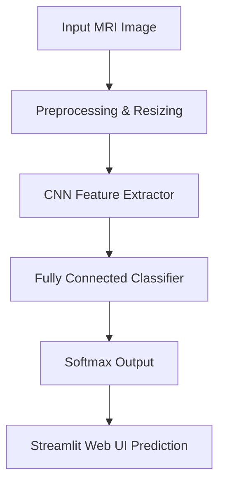

# AI Brain Tumor Detection

> Deep Learning framework for automated MRI brain tumor classification using PyTorch and Streamlit.

[Repository](https://github.com/SanyogSingh07/AI-Brain-Tumor-Detection)

---

## Overview

**AI Brain Tumor Detection** is a computer vision pipeline and web application built to assist in automated medical image analysis. It leverages a Convolutional Neural Network (CNN) trained on brain MRI scans to classify images into tumor and non-tumor categories.

> [!NOTE]
> **Academic & Research Prototype**: This system is designed for research demonstration and computer vision workflow evaluation. It is not a clinical diagnostic tool.

---

## Problem Statement

Manual diagnosis of brain tumors from MRI scans requires specialized radiological expertise and can be time-intensive. Automated image classification provides rapid triage support, aiding in preliminary screening and educational research.

---

## Solution & Architecture

The system processes raw MRI scans through a multi-stage computer vision pipeline:



### Key Technical Features
- **Convolutional Neural Network (CNN)**: Multi-layer feature extraction capturing spatial patterns in MRI contrast variations.
- **Data Preprocessing**: Image normalization, resizing, and tensor transformation pipelines.
- **Interactive Web Interface**: Built using **Streamlit** for real-time image upload and inference visualization.

---

## Dataset

- **Source**: Kaggle Brain MRI Images Dataset for Brain Tumor Detection.
- **Classes**:
  - `Tumor` (Positive MRI scans)
  - `No Tumor` (Healthy control MRI scans)

---

## Tech Stack

- **Core**: Python 3.8+
- **Deep Learning**: PyTorch, torchvision
- **Web App**: Streamlit
- **Image Processing**: OpenCV, Pillow, NumPy
- **Environment**: CUDA acceleration supported (`cuda_check.py`)

---

## Evaluation & Results

- **Model Metrics**: Training loss monitoring and classification evaluation via confusion matrix logs.
- **Visual Artifacts**: Performance plots and validation metrics generated during training (`train.py`).

*Evaluation metrics are recorded during training runs and stored in the model execution logs.*

---

## Project Structure

```text
AI-Brain-Tumor-Detection/
├── app.py                # Streamlit web application interface
├── train.py              # PyTorch model training loop
├── predict.py            # Single-image inference module
├── cuda_check.py         # GPU/CUDA capability check script
├── requirements.txt      # Project dependencies
└── README.md
```

---

## Installation & Setup

### 1. Prerequisites
- Python 3.8+
- PyTorch (with CUDA support if GPU is available)

### 2. Setup Environment
```bash
git clone https://github.com/SanyogSingh07/AI-Brain-Tumor-Detection.git
cd AI-Brain-Tumor-Detection
python -m venv .venv
# Activate venv: Windows: .venv\Scripts\activate | Unix: source .venv/bin/activate
pip install -r requirements.txt
```

### 3. Launch Web App
```bash
streamlit run app.py
```

---

## Limitations

- Binary classification (Tumor vs. No Tumor); does not distinguish specific tumor types (e.g., glioma, meningioma, pituitary).
- Model performance depends on input scan resolution and contrast alignment.

---

## Future Improvements

- Multi-class tumor classification (Glioma, Meningioma, Pituitary, No Tumor).
- Explainable AI integration using **Grad-CAM** for spatial tumor localization.
- Containerized deployment via Docker.

---

## License

Distributed under the **MIT License**. See `LICENSE` for details.
